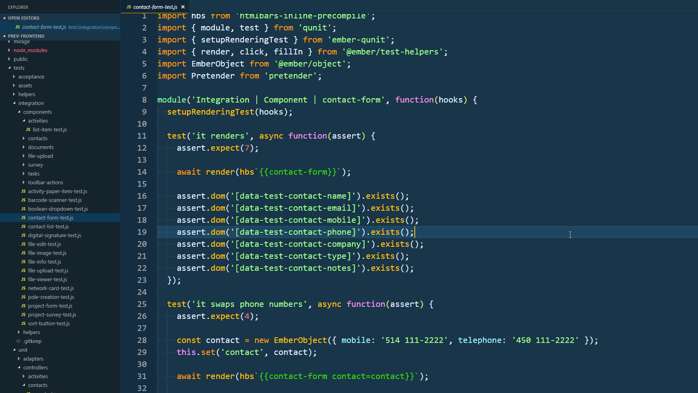

# Ember Navigator

The Ember Navigator VS Code extension aims facilitate Ember.js application development by providing shortcuts and contextual navigation via the command palette.

## Features

## Requirements

No external requirements for now!

## Release Notes

### 1.0.0
- Initial release of Ember Navigator!